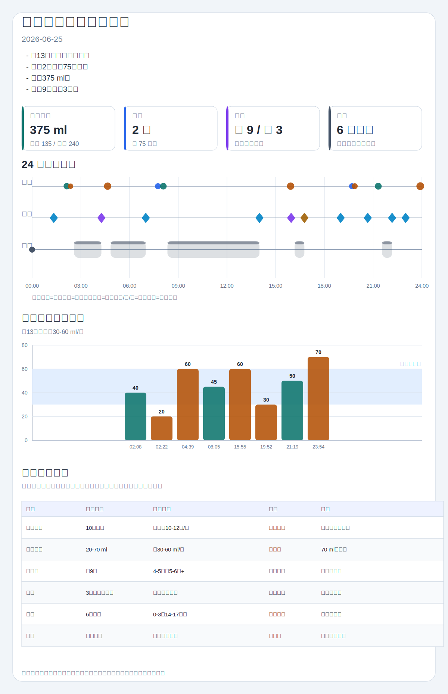

# 新生儿喂养可视化日报

### 今日概览

- 喂养：全天记录 10 个喂养事件，其中亲喂 4 次共 135 分钟，瓶喂母乳 2 次共 68 ml，奶粉 4 次共 233 ml。
- 瓶喂总量：可统计瓶喂总量为 301 ml；多次亲喂后 13-17 分钟内追加瓶喂，属于混合喂养节奏，需要结合宝宝饥饿信号、体重增长和医嘱判断。
- 尿便：按“换尿不湿且未写大便，默认计小便”的口径，小便 12 次；明确大便 4 次，均为黄色糊状，奶瓣从有到无均有记录。
- 睡眠：记录 4 次入睡，但没有醒来时间，只能推测睡眠分布，不能计算真实总睡眠时长。
- 观察重点：22:55 有少量吐奶；16:07 和 23:10 记录侧卧，睡姿安全可温和优化为仰卧入睡。

### 喂养分析

| 状态 | 判断 | 证据 | 优化建议 |
|---|---|---|---|
| 较好 | 奶源分类较清楚，亲喂、瓶喂母乳和奶粉能分开统计 | 08:05、21:12 为母乳 ml；12:09、15:51、18:20、22:36 为奶粉 ml；4 次亲喂有左右侧时长 | 继续把亲喂、瓶喂母乳、奶粉分开写，亲喂不换算为 ml |
| 较好 | 多数补喂后有拍嗝或吐奶观察 | 08:32 拍嗝 8 分钟且 0 吐奶；15:53 拍嗝 10 分钟且 0 吐奶；22:55 拍嗝 8 分钟，吐奶不多 | 继续记录拍嗝时长、吐奶量和是否喷射 |
| 需要关注 | 多次亲喂后很快追加瓶喂，可能是正常补喂，也可能提示亲喂有效摄入需继续观察 | 07:52 亲喂后 08:05 母乳 20 ml；15:37 亲喂后 15:51 奶粉 40 ml；20:55 亲喂后 21:12 母乳 48 ml | 补充“补奶原因”：仍寻乳、哭闹、医嘱补喂、还是常规安排；同时观察喂后满足度和体重变化 |
| 可优化 | 单日奶量是否合适无法只凭记录判断 | 缺少日龄、体重、出生体重、当日精神状态和医生喂养目标 | 后续补充关键背景，便于把奶量与日龄和体重增长放在一起看 |

| 观察项 | 结论 | 证据 | 建议 |
|---|---|---|---|
| 亲喂母乳 | 4 次，共 135 分钟；左侧 60 分钟，右侧 75 分钟 | 07:52 35 分钟；10:50 35 分钟；15:37 35 分钟；20:55 30 分钟 | 左右侧总时长略偏右侧，后续可继续记录含乳、吞咽和是否有效吸吮 |
| 瓶喂母乳 | 2 次，共 68 ml | 08:05 20 ml；21:12 48 ml | 与奶粉分列记录，避免总奶量判断混淆 |
| 奶粉/配方奶 | 4 次，共 233 ml；单次 40-75 ml | 12:09 58 ml；15:51 40 ml；18:20 75 ml；22:36 60 ml | 75 ml 这次相对较高，建议结合日龄、体重和喂后反应观察 |
| 喂养节律 | 相邻喂养间隔从 13 分钟到约 3 小时 28 分钟不等 | 最短为亲喂后追加瓶喂；最长为 12:09 到 15:37 | 对短间隔补喂记录饥饿信号；对较长间隔观察是否睡眠较长或主动醒奶 |
| 吐奶/拍嗝 | 4 次拍嗝记录，1 次少量吐奶 | 22:55 “吐奶不多”；其余两处写 0 吐奶 | 若吐奶变频繁、喷射性或伴精神差，应及时咨询儿科医生 |

### 排便排尿分析

| 项目 | 今日记录 | 解读 |
|---|---|---|
| 小便 | 按规则统计 12 次：07:20、08:30、10:45、11:00、12:30、15:40、18:05、19:39、21:00、21:20、21:40、22:50 | 次数看起来充足，但多条只写“换尿不湿”，未写尿量和尿色，统计口径可能高估真实湿尿布质量 |
| 大便 | 明确 4 次：17:57、18:05、19:39、22:50 | 均为黄色糊状；17:57 和 19:39 量多，18:05 和 22:50 量中 |
| 奶瓣 | 17:57、18:05、19:39 有奶瓣或少量奶瓣；22:50 没奶瓣 | 单日记录中没有血便、黑便或白陶土样便描述；奶瓣可继续结合腹胀、哭闹、体重增长观察 |

排便集中在傍晚到夜间，颜色和性状记录比较完整。后续若出现水样便明显增多、血丝、黑便、白陶土样便、尿明显减少或精神差，应及时咨询儿科医生。

### 睡眠推测

| 入睡时间 | 可推测结束上限 | 记录依据 | 说明 |
|---|---|---|---|
| 08:43 | 10:45 前后 | 下一条护理记录为 10:45 换尿不湿 | 只能说明这段时间内可能睡过，不能等同于睡满 2 小时 2 分钟 |
| 12:42 | 15:37 前后 | 下一条护理/喂养记录为 15:37 亲喂 | 只能作为上限估计，缺少醒来时间 |
| 16:07 | 17:57 前后 | 下一条记录为 17:57 大便 | 记录睡姿为右侧卧、头偏右 |
| 23:10 | 未记录 | 后续没有睡醒或下一条护理记录 | 只确认入睡，无法估算时长 |

前三段如果按下一条记录作为上限，合计约 6 小时 47 分钟，但这不是全天真实睡眠总量。记录中出现抱睡和侧卧，建议在安抚后尽量转为仰卧、坚实平坦睡眠表面，并记录醒来时间。

### 观察优先级

| 级别 | 内容 |
|---|---|
| 继续保持 | 奶源分类较清楚；亲喂左右侧时长记录完整；多次喂后记录拍嗝和吐奶；大便颜色、性状、量记录较完整 |
| 建议补充记录 | 宝宝日龄、体重、出生体重；每次换尿不湿是否明显有尿、尿量和尿色；亲喂后补奶原因和喂后满足度；每段睡眠的醒来时间 |
| 需要观察 | 22:55 少量吐奶是否反复；大便奶瓣是否伴随腹胀、哭闹或体重增长不佳；侧卧睡姿可逐步调整为仰卧入睡 |
| 建议咨询医生 | 暂无明确需要；若出现持续发热、精神差、尿量明显减少、血便、黑便、白陶土样便、喷射性或反复呕吐，应及时咨询儿科医生或就医 |

### 信息缺口

- 原文时间“18:020”疑似笔误，本报告按 18:20 整理；建议确认原始时间。
- 未记录宝宝日龄、胎龄、当前体重、出生体重和医生喂养建议，影响奶量参考区间判断。
- 未记录睡醒时间，无法计算真实睡眠总时长，也无法与 0-3 月常见睡眠时长做精确对比。
- 多条“换尿不湿”没有写是否明显有尿、尿量、尿色；本报告已按项目口径计小便，但建议后续补充尿量描述。
- 亲喂后追加瓶喂的原因未记录，建议写明是否仍寻乳、哭闹、未满足、医嘱补喂或照护安排。
- 体温、精神状态、体重变化未记录；若用于连续追踪，建议每天补充。

### 统计视图

#### 趋势速览

| 维度 | 今日趋势 | 主要证据 | 观察点 |
|---|---|---|---|
| 喂养 | 白天到夜间均有喂养，晚间有母乳瓶喂和奶粉补喂 | 07:52 到 22:36 共 10 个喂养事件 | 短间隔追加瓶喂时，记录饥饿信号和喂后满足度 |
| 排便排尿 | 小便记录分散，大便集中在 17:57 后 | 小便 12 次；大便 4 次，均在傍晚和夜间 | 换尿布默认小便口径已使用，后续补尿量更准确 |
| 睡眠 | 记录 4 次入睡，缺少醒来时间 | 08:43、12:42、16:07、23:10 | 无法判断全天总睡眠是否接近参考范围 |
| 安全睡眠 | 有侧卧和抱睡记录 | 16:07 右侧卧；23:10 左侧卧；两段写抱起睡 | 可温和调整为仰卧、坚实平坦睡眠环境 |

#### 参考区间对比

> 以下仅作常见参考，需结合日龄、体重、医嘱、喂养方式和宝宝状态；不能替代医生诊断。

| 指标 | 今日记录 | 常见参考区间 | 对比 | 备注 |
|---|---|---|---|---|
| 喂养频次 | 亲喂+瓶喂共 10 个事件 | 母乳喂养新生儿常见约 10-12 次/24 小时；瓶喂新生儿常见每 2-3 小时一次 | 需结合混合喂养判断 | 亲喂和补瓶短间隔出现时，不宜简单按“次数偏多”判断 |
| 瓶喂单次量 | 20-75 ml/次 | 出生后最初几周常见 30-60 ml/次，满月前后可更高 | 多数接近参考，75 ml 需结合日龄观察 | 亲喂不换算为 ml |
| 湿尿布 | 按口径统计 12 次 | 出生 4-5 天后常见至少 5-6 次/日 | 看起来充足 | 由于多条只写换尿不湿，建议补充尿量和尿色 |
| 大便 | 4 次，黄色糊状 | 约第 4 天起可见多次大便，差异较大 | 接近常见参考 | 继续观察颜色、性状和精神状态 |
| 睡眠 | 无法精确计算 | 0-3 月常见约 14-17 小时/日 | 无法判断 | 缺少醒来时间 |
| 睡姿安全 | 2 次侧卧，2 次抱睡描述 | 通常建议每次睡眠从仰卧开始，表面坚实、平坦、水平 | 可优化 | 温和提醒照护者统一睡姿口径 |

#### 关键数据

| 项目 | 统计结果 | 备注 |
|---|---|---|
| 亲喂母乳 | 4 次，共 135 分钟；左 60 分钟，右 75 分钟 | 不换算奶量 |
| 瓶喂母乳 | 2 次，共 68 ml | 08:05 20 ml；21:12 48 ml |
| 奶粉/配方奶 | 4 次，共 233 ml | 12:09 58 ml；15:51 40 ml；18:20 75 ml；22:36 60 ml |
| 瓶喂总量 | 301 ml | 母乳瓶喂 + 奶粉 |
| 小便 | 12 次 | 未写大便的换尿不湿按小便计入 |
| 大便 | 4 次 | 黄色糊状，有/少量/无奶瓣均有记录 |
| 睡眠 | 4 次入睡 | 缺醒来时间，无法精确统计 |
| 体温/异常 | 体温未记录；吐奶 1 次不多 | 其余吐奶记录为 0 或未记录 |

#### 喂养时间线

| 时间 | 类型 | 内容 | 解读 |
|---|---|---|---|
| 07:52 | 亲喂母乳 | 左 15 分钟，右 20 分钟 | 本次亲喂 35 分钟 |
| 08:05 | 瓶喂母乳 | 20 ml | 距上次亲喂开始约 13 分钟，可能是亲喂后补瓶 |
| 10:50 | 亲喂母乳 | 右 20 分钟，左 15 分钟 | 本次亲喂 35 分钟 |
| 12:09 | 奶粉 | 58 ml | 距上次亲喂开始约 1 小时 19 分钟 |
| 15:37 | 亲喂母乳 | 右 20 分钟，左 15 分钟 | 本次亲喂 35 分钟 |
| 15:51 | 奶粉 | 40 ml | 距上次亲喂开始约 14 分钟，可能是亲喂后补瓶 |
| 18:20 | 奶粉 | 75 ml | 原文为 18:020，按疑似笔误整理 |
| 20:55 | 亲喂母乳 | 左右各 15 分钟 | 本次亲喂 30 分钟 |
| 21:12 | 瓶喂母乳 | 48 ml | 距上次亲喂开始约 17 分钟，可能是亲喂后补瓶 |
| 22:36 | 奶粉 | 60 ml | 22:55 拍嗝 8 分钟，吐奶不多 |

## 说明

- PNG 截图优先用于 Markdown 预览；SVG 保留为可缩放源图。
- PNG 依赖本地可用的 Chrome、Edge、Chromium headless 或浏览器插件截图能力。
- 图表仅用于趋势观察，参考区间不能替代医生诊断。

## 可视化图表

> 未生成 PNG 截图：本机 Edge headless 截图被 Windows 权限拒绝；已保留 SVG 和 HTML 可视化文件。
