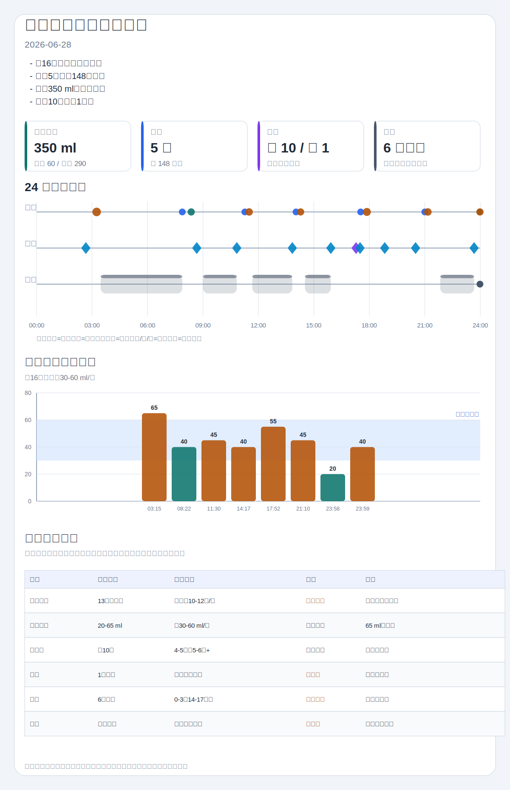

# 新生儿喂养可视化日报

### 今日概览

- 宝宝信息：baby-info.md 记录性别为男；出生日期写作 `2026-06012`，疑似为 `2026-06-12`，本报告按 2026-06-28 约 16 日龄（出生第 17 天）估算参考口径。
- 喂养：记录内共有 13 个喂养事件，其中亲喂 5 次共 148 分钟，瓶喂母乳 2 次共 60 ml，奶粉 6 次共 290 ml。
- 瓶喂总量：可统计瓶喂总量为 350 ml；其中 00:00 和 00:20 属于 2026-06-29 凌晨的跨日尾段，已保留并单独说明。
- 尿便：按“换尿不湿且未写大便，默认计小便”的口径，小便约 10 次；明确大便 1 次，为黄色糊状、少量奶瓣、量多。
- 睡眠：记录 6 次入睡，但均没有明确醒来时间；多次侧卧和抱起睡，睡姿安全可继续温和优化为仰卧入睡。

### 喂养分析

| 状态 | 判断 | 证据 | 优化建议 |
|---|---|---|---|
| 较好 | 奶源分类较清楚，亲喂、瓶喂母乳和奶粉能分开统计 | 08:22、次日 00:00 为母乳 ml；03:15、11:30、14:17、17:52、21:10、次日 00:20 为奶粉 ml；5 次亲喂有左右侧时长 | 继续分开写亲喂、瓶喂母乳、奶粉；亲喂不换算为 ml |
| 较好 | 多数瓶喂后有拍嗝和吐奶/溢奶观察 | 03:17、08:45、11:33、14:20、21:12、次日 00:22 有拍嗝记录；多处写 0 吐奶或有点溢奶 | 继续记录拍嗝时长、是否溢奶、是否喷射性呕吐 |
| 需要关注 | 多次亲喂后短时间内追加瓶喂，可能是正常补喂，也可能需要结合有效吸吮和饥饿信号判断 | 07:53 亲喂后 08:22 母乳 40 ml；11:16 后 11:30 奶粉 45 ml；14:02 后 14:17 奶粉 40 ml；17:32 后 17:52 奶粉 55 ml；21:00 后 21:10 奶粉 45 ml | 后续补充“补奶原因”：仍寻乳、哭闹、医嘱补喂、还是常规安排；同时观察喂后满足度和体重增长 |
| 需要关注 | 溢奶和肠胀气有记录，但未见持续风险描述 | 08:45 有点溢奶；11:33 记录肠胀气、有点溢奶；次日 00:22 有点溢奶 | 若溢奶增多、喷射性呕吐、伴精神差或尿量减少，应及时咨询儿科医生 |
| 可优化 | 出生日期和跨日时间需修正，影响日龄参考和归档 | baby-info.md 写作 `2026-06012`；23:40 后出现 00:00、00:20、00:28 | 建议把出生日期修正为标准 `YYYY-MM-DD`，并在跨日记录前写“次日”或日期 |

| 观察项 | 结论 | 证据 | 建议 |
|---|---|---|---|
| 亲喂母乳 | 5 次，共 148 分钟；左侧约 73 分钟，右侧约 75 分钟 | 07:53 30 分钟；11:16 30 分钟；14:02 28 分钟；17:32 30 分钟；21:00 30 分钟 | 左右侧时长接近；继续记录含乳、吞咽和是否有效吸吮 |
| 瓶喂母乳 | 2 次，共 60 ml | 08:22 40 ml；次日 00:00 20 ml | 与奶粉分列，避免总奶量判断混淆 |
| 奶粉/配方奶 | 6 次，共 290 ml；单次 40-65 ml | 03:15 65 ml；11:30 45 ml；14:17 40 ml；17:52 55 ml；21:10 45 ml；次日 00:20 40 ml | 单次量多在 40-55 ml，03:15 为 65 ml，需结合宝宝饱足、溢奶和体重观察 |
| 喂养节律 | 白天多为亲喂后补瓶，夜间有跨日补喂 | 07:53/08:22、11:16/11:30、14:02/14:17、17:32/17:52、21:00/21:10 | 对短间隔补喂记录饥饿信号；若为计划补喂，可注明医嘱或家庭方案 |
| 拍嗝/溢奶 | 约 6 次拍嗝记录；3 次轻微溢奶 | 08:45、11:33、次日 00:22 写有点溢奶；03:17、14:20、21:12 写 0 吐奶 | 轻微溢奶可继续观察；关注是否喷射、频繁、伴精神差或尿少 |

### 排便排尿分析

| 项目 | 今日记录 | 解读 |
|---|---|---|
| 小便 | 按规则统计约 10 次：02:40、08:40、10:50、13:50、15:55、17:17、17:30、18:50、20:30、23:40 | 次数看起来充足；但多数只写“换尿不湿”，未写尿量和尿色，真实湿尿布质量仍需结合尿量判断 |
| 大便 | 明确 1 次：17:17 | 黄色糊状，有少量奶瓣，量多；同时明确有小便 |
| 奶瓣 | 17:17 写少量奶瓣 | 单日少量奶瓣可先结合喂养、体重、精神状态观察；若伴腹胀明显、哭闹、血便或体重增长差，应咨询医生 |

今日大便次数少于前两天记录中的多次排便，但本日大便量多、颜色为黄色、性状糊状。若后续连续排便明显减少、腹胀哭闹加重、尿量减少、血便、黑便或白陶土样便，应及时咨询儿科医生。

### 睡眠推测

| 入睡时间 | 可推测结束上限 | 记录依据 | 说明 |
|---|---|---|---|
| 03:28 | 07:53 前后 | 下一条喂养记录为 07:53 亲喂 | 记录左侧卧、头偏左；只能作为上限估计 |
| 09:00 | 10:50 前后 | 下一条护理记录为 10:50 换尿不湿 | 记录抱起睡；缺少放下时间和醒来时间 |
| 11:40 | 13:50 前后 | 下一条护理记录为 13:50 换尿不湿 | 记录左侧卧、头偏左；只能作为上限估计 |
| 14:31 | 15:55 前后 | 下一条护理记录为 15:55 换尿不湿 | 记录右侧卧、头偏右；缺少醒来时间 |
| 21:50 | 23:40 前后 | 下一条护理记录为 23:40 换尿不湿 | 记录右侧卧、头偏右；只能作为上限估计 |
| 次日 00:28 | 未记录 | 位于次日 00:22 拍嗝之后，判断为跨日入睡 | 记录右侧卧、头偏右；无结束时间 |

若仅按下一条记录作为上限，前 5 段合计约 11 小时 39 分钟，但这不是全天真实睡眠总量。建议后续补充醒来时间；涉及睡姿时，可在安抚后尽量转为仰卧、坚实平坦睡眠表面。

### 观察优先级

| 级别 | 内容 |
|---|---|
| 继续保持 | 奶源分类清楚；亲喂左右侧时长记录较完整；多数瓶喂后有拍嗝和吐奶观察；大便颜色、性状、量记录清楚 |
| 建议补充记录 | 修正 baby-info.md 出生日期；记录当前体重、出生体重和医生喂养建议；每次换尿不湿补充尿量、尿色；每段睡眠补充醒来时间 |
| 需要观察 | 轻微溢奶是否增多；肠胀气是否持续影响吃奶和睡眠；大便次数是否连续减少；侧卧和抱起睡可逐步统一为仰卧入睡 |
| 建议咨询医生 | 暂无明确需要；若出现持续发热、精神差、尿量明显减少、血便、黑便、白陶土样便、喷射性或反复呕吐，应及时咨询儿科医生或就医 |

### 信息缺口

- baby-info.md 出生日期写作 `2026-06012`，不是标准日期格式；本报告按疑似 `2026-06-12` 估算，建议修正。
- 00:00、00:20、00:28 位于 23:40 之后，本报告按 2026-06-29 凌晨跨日尾段处理；建议后续明确写“次日”或完整日期。
- 17:32 原文“左边两边各吸15分钟”疑似笔误，本报告按左右各 15 分钟统计；建议确认。
- 未记录胎龄、当前体重、出生体重和医生喂养建议，会影响约 16 日龄的奶量参考判断。
- 多条“换尿不湿”没有写尿量、尿色；本报告已按项目口径计小便，但建议后续补充。
- 睡眠记录缺醒来时间、放下时间和是否独立睡眠，因此无法精确计算全天睡眠总时长。

### 统计视图

#### 趋势速览

| 维度 | 今日趋势 | 主要证据 | 观察点 |
|---|---|---|---|
| 喂养 | 白天多为亲喂后补瓶，夜间有跨日尾段 | 13 个喂养事件，含次日 00:00 和 00:20 | 短间隔补喂时记录饥饿信号和喂后满足度 |
| 排便排尿 | 小便分散，大便 1 次且量多 | 小便约 10 次；17:17 大便量多 | 继续观察尿量和大便频次变化 |
| 睡眠 | 多次入睡，缺少醒来时间 | 03:28、09:00、11:40、14:31、21:50、次日 00:28 | 无法判断全天总睡眠是否接近参考范围 |
| 安全睡眠 | 侧卧和抱起睡较多 | 03:28、11:40、14:31、21:50、次日 00:28 均非仰卧或未独立睡 | 可继续把仰卧入睡作为默认目标 |

#### 参考区间对比

> 以下仅作常见参考，需结合日龄、体重、医嘱、喂养方式和宝宝状态；不能替代医生诊断。

| 指标 | 今日记录 | 常见参考区间 | 对比 | 备注 |
|---|---|---|---|---|
| 喂养频次 | 亲喂+瓶喂共 13 个事件，含跨日尾段 | 母乳喂养新生儿常见约 10-12 次/24 小时；瓶喂新生儿常见每 2-3 小时一次 | 需结合混合喂养判断 | 亲喂后补瓶不宜简单按“次数偏多”判断 |
| 瓶喂单次量 | 20-65 ml/次，多数 40-55 ml | 约 16 日龄常见单次约 30-60 ml，需结合体重和医嘱 | 多数接近参考 | 65 ml 和 20 ml 分别需结合饱足和补喂场景看 |
| 湿尿布 | 按口径统计约 10 次 | 出生 4-5 天后常见至少 5-6 次/日 | 看起来充足 | 建议补充尿量和尿色 |
| 大便 | 1 次，黄色糊状、量多 | 新生儿大便差异大，可结合日龄和喂养方式观察 | 需继续观察 | 若连续减少并伴不适，再咨询医生 |
| 睡眠 | 6 次入睡，无法精确总时长 | 0-3 月常见约 14-17 小时/日 | 无法判断 | 缺醒来时间，且有跨日记录 |
| 睡姿安全 | 多次侧卧或抱起睡 | 通常建议每次睡眠从仰卧开始，表面坚实、平坦、水平 | 可优化 | 温和提醒照护者统一睡姿口径 |

#### 关键数据

| 项目 | 统计结果 | 备注 |
|---|---|---|
| 宝宝信息 | 男；疑似 2026-06-12 出生；记录日约 16 日龄 | 原始出生日期格式需修正 |
| 亲喂母乳 | 5 次，共 148 分钟；左约 73 分钟，右约 75 分钟 | 不换算奶量 |
| 瓶喂母乳 | 2 次，共 60 ml | 08:22 40 ml；次日 00:00 20 ml |
| 奶粉/配方奶 | 6 次，共 290 ml | 03:15 65 ml；11:30 45 ml；14:17 40 ml；17:52 55 ml；21:10 45 ml；次日 00:20 40 ml |
| 瓶喂总量 | 350 ml | 母乳瓶喂 + 奶粉；含跨日尾段 |
| 小便 | 约 10 次 | 未写大便的换尿不湿按小便计入 |
| 大便 | 1 次 | 黄色糊状，少量奶瓣，量多 |
| 睡眠 | 6 次入睡 | 缺醒来时间，无法精确统计；00:28 为跨日记录 |
| 体温/异常 | 体温未记录；轻微溢奶 3 次；11:33 记录肠胀气；吃 AD 1 次 | 不提供补充剂剂量建议，只保留原始护理记录 |

#### 喂养时间线

| 时间 | 类型 | 内容 | 解读 |
|---|---|---|---|
| 03:15 | 奶粉 | 65 ml | 03:17 拍嗝 8 分钟，0 吐奶 |
| 07:53 | 亲喂母乳 | 左右各 15 分钟 | 本次亲喂 30 分钟 |
| 08:22 | 瓶喂母乳 | 40 ml | 08:45 拍嗝 10 分钟，有点溢奶 |
| 11:16 | 亲喂母乳 | 左右各 15 分钟 | 本次亲喂 30 分钟 |
| 11:30 | 奶粉 | 45 ml | 11:33 拍嗝 10 分钟，肠胀气，有点溢奶，吃 AD |
| 14:02 | 亲喂母乳 | 右 15 分钟，左 13 分钟 | 本次亲喂 28 分钟 |
| 14:17 | 奶粉 | 40 ml | 14:20 拍嗝 8 分钟，0 吐奶 |
| 17:32 | 亲喂母乳 | 按左右各 15 分钟统计 | 原文疑似笔误，本次按 30 分钟计 |
| 17:52 | 奶粉 | 55 ml | 未记录拍嗝 |
| 21:00 | 亲喂母乳 | 左右各 15 分钟 | 本次亲喂 30 分钟 |
| 21:10 | 奶粉 | 45 ml | 21:12 拍嗝 11 分钟，0 吐奶 |
| 次日 00:00 | 瓶喂母乳 | 20 ml | 跨日尾段，图中压到日末附近 |
| 次日 00:20 | 奶粉 | 40 ml | 00:22 拍嗝，有点溢奶 |

## 说明

- PNG 截图优先用于 Markdown 预览；SVG 保留为可缩放源图。
- PNG 依赖本地可用的 Chrome、Edge、Chromium headless 或浏览器插件截图能力。
- 图表仅用于趋势观察，参考区间不能替代医生诊断。

## 可视化图表

> 未生成 PNG 截图：本机 Edge headless 截图被 Windows 权限拒绝；已保留 SVG 和 HTML 可视化文件。
